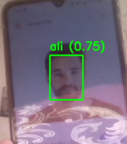

## Face Recognition System (Embedding-Based)

A real-time face recognition system based on deep face embeddings and cosine similarity, built using InsightFace.
The system can recognize known identities and label unknown faces without retraining the model.
for large-scale datasets, FAISS can be used to replace brute-force similarity search

## Features

Real-time face detection and recognition
Embedding-based identity matching (ArcFace)
Add new people without retraining
Robust to lighting and pose variations
Works on CPU (no GPU required)

## Tech Stack

Python 3.9 / 3.10
OpenCV
InsightFace
NumPy
ONNX Runtime

## Installation

Create Virtual Environment (Recommended)
python -m venv venv 
source venv/bin/activate # Linux/Mac 
venv\Scripts\activate # Windows 
Install Dependencies
pip install -r requirements.txt 

## Why Embedding-Based Recognition?

No retraining required for new identities
Scalable and efficient
Industry-standard approach (used in FaceID-like systems)

## Demo

